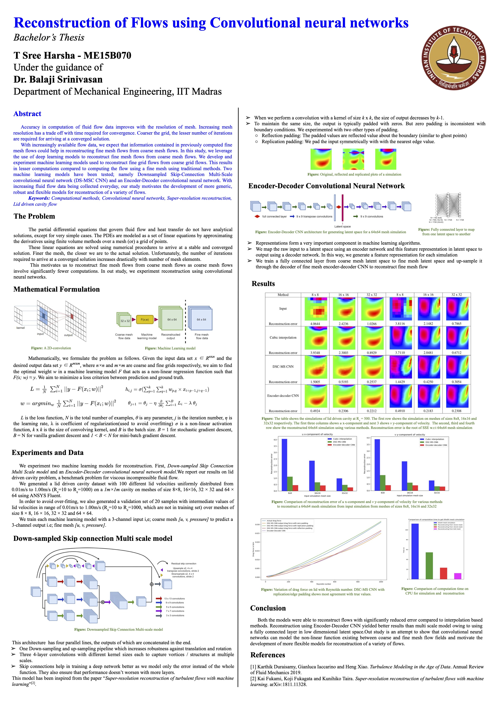

Accuracy in computation of fluid flow data using finite volume methods improves with the resolution of the mesh. Increasing mesh resolution has a trade-off with time required for convergence. Coarser the grid, the lesser number of iterations are required for arriving at a converged solution. With increasingly available flow data, we expect that information contained in previously computed fine mesh flows could help in reconstructing fine mesh flows from coarse mesh flows. This reconstruction called super-resolution analysis is a popular area of research in deep learning.
<!--more-->

Accuracy in computation of fluid flow data using finite volume methods improves with the resolution of the mesh. Increasing mesh resolution has a trade-off with time required for convergence. Coarser the grid, the lesser number of iterations are required for arriving at a converged solution. With increasingly available flow data, we expect that information contained in previously computed fine mesh flows could help in reconstructing fine mesh flows from coarse mesh flows. This reconstruction called super-resolution analysis is a popular area of research in deep learning. In this study, we leverage the use of deep learning models to reconstruct fine mesh flows from coarse mesh flows. We develop and experiment machine learning models used to reconstruct fine grid flows from coarse grid flows. This results in lesser computations compared to computing the flow using a fine mesh using traditional methods. Two machine learning models have been tested; namely Down-sampled skip-connection multi-scale convolutional neural network (DS-MSC CNN) inspired from [2] and a novel encoder-decoder convolutional neural network. We assessed the performance of these two models on reconstructing lid-driven cavity flows over a wide range of Reynolds numbers as a preliminary test. Both the models have shown remarkable accuracy in reconstructing fine grid flows from heavily under-resolved flows(up-to 8 times finer mesh). We also addressed the inconsistencies of padding in convolutions with boundary conditions. We experimented with different ways of padding to improve predictions at the boundary and provide a comparison using drag force as metric. With increasing fluid flow data being collected every day, our study motivates the development of more generic, robust and flexible models for reconstruction of a variety of flows.

